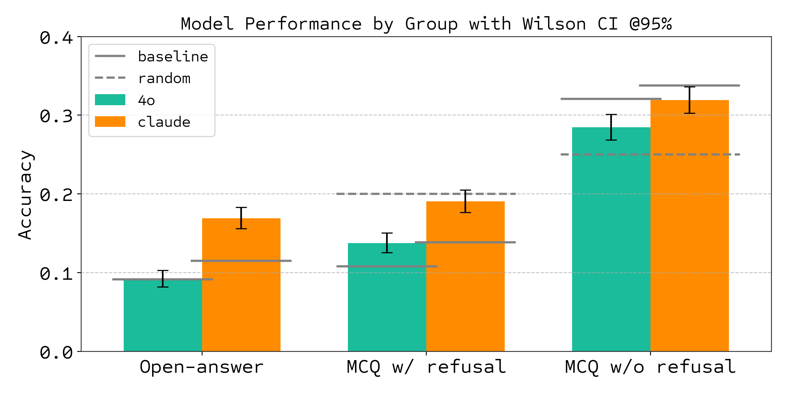
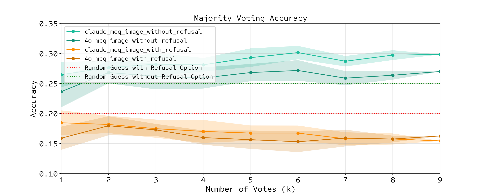

<p align="center">
    <a href="https://arxiv.org/abs/2503.00096">
    
    <a href = "https://github.com/Future-House/BixBench">
    
    <a href="https://huggingface.co/datasets/futurehouse/BixBench">
    
</p>

# BixBench: A Comprehensive Benchmark for LLM-based Agents in Computational Biology

BixBench is a benchmark designed to evaluate AI agents on real-world bioinformatics tasks.
This benchmark tests AI agents' ability to:

- Explore biological datasets
- Perform long, multi-step computational analyses
- Interpret nuanced results in the context of a research question

BixBench presents AI agents with open-ended or multiple-choice tasks, requiring them to navigate datasets, execute code (Python, R, Bash), generate scientific hypotheses, and validate them.
The dataset contains 296 questions derived from 53 real-world, published Jupyter notebooks and related data (capsules).

You can find the BixBench dataset in [Hugging Face](https://huggingface.co/datasets/futurehouse/BixBench), read details in the paper [here](https://arxiv.org/abs/2503.00096), and read our the blog post announcement [here](https://www.futurehouse.org/research-announcements/bixbench).

This repository enables three separate functions:

1. Agentic evaluations of LLMs on BixBench
2. Zero-shot evaluations of LLMs on BixBench
3. Replicating the BixBench paper results

## Links

- [Installation](#installation)
- [Agentic Evaluations](#agentic-evaluations)
- [Using Your Own Agent](#using-your-own-agent)
- [Zero-shot Evaluations](#zero-shot-evaluations)
- [Replicating the BixBench Paper Results](#replicating-the-bixbench-paper-results)
- [Acknowledgments](#acknowledgments)

## Installation

To set up the repository, first clone it and install the dependencies:

```bash
# Clone the repository
git clone https://github.com/Future-House/BixBench.git
cd BixBench

# Install dependencies
pip install -e .  # or `uv sync` if you are using uv
```

Next, you will need to be able to access the BixBench dataset. To do this, you will have to authenticate with Hugging Face:

```bash
# Authenticate with Hugging Face
huggingface-cli login
```

See [here](https://huggingface.co/docs/huggingface_hub/en/guides/cli) for how to get started with the Hugging Face CLI and [here](https://huggingface.co/docs/huggingface_hub/en/guides/security-tokens) for more information on how to create a token.

Finally, the agent executes its data analysis code in a containerized environment. So to run it, you will need to pull the docker image:

```bash
# Pull the docker image
docker pull futurehouse/bixbench:aviary-notebook-env
```

See [here](https://www.docker.com/get-started/) for instructions on how to set up Docker.

## Prerequisites

### API Keys

We support all LLMs that are supported by [litellm](https://github.com/BerriAI/litellm). Create a `.env` file with the API keys for the LLMs you want to evaluate. For example:

```
OPENAI_API_KEY = "your-openai-api-key"
ANTHROPIC_API_KEY = "your-anthropic-api-key"
```

## Agentic Evaluations

BixBench evaluates agents' ability to create complex Jupyter notebooks for real-world bioinformatics research questions. To evaluate an LLM on BixBench we separate the process into two steps:

1. Generate trajectories
2. Evaluate the trajectories via postprocessing

### Generate Trajectories

BixBench evaluates agents' ability to create complex Jupyter notebooks for real-world bioinformatics research questions. To generate these trajectories, it's as simple as configuring a YAML file and running the following command:

```bash
python bixbench/generate_trajectories.py --config_file bixbench/run_configuration/generate_trajectories.yaml
```

This will:

1. Download the BixBench dataset from Hugging Face (only needed once)
2. Preprocess each capsule in the dataset
3. Generate and store trajectories including the final agent answer and Jupyter notebook in the directory specified in the YAML file

Trajectories are saved in the `bixbench_results/` directory as json files.

### Customization

Edit or create a new YAML file to modify:

- Model configurations
- System prompts
- Batch sizes
- File paths
- Evaluation modes
- Rollout configuration

### Using Your Own Agent

To use your own agent, use the `generate_trajectories.py` script by editing the [`custom_rollout`](https://github.com/Future-House/BixBench/blob/6c28217959d5d7dd6f48c59894534fced7c6c040/bixbench/generate_trajectories.py#L239) function to generate trajectories in the same format as the BixBench trajectories, then use the `postprocessing.py` script to evaluate your agent's performance.

### Hosted trajectory generation

Coming soon!

### Evaluate trajectories

Similarly, to evaluate the trajectories, we use the `postprocessing.py` script alongside a YAML configuration file:

```bash
python bixbench/postprocessing.py --config_file bixbench/run_configuration/postprocessing.yaml
```

This script will:

1. Load the raw trajectory data
2. Create an evaluation dataframe
3. Run majority vote analysis (for MCQ questions)
4. Compare model performance across different run groups defined in the YAML file
5. Generate visualizations

The script will save the evaluation dataframe as a CSV file in the `bixbench_results/` directory as well as the plots.

## Zero-shot Evaluations & Grading

You can run zero-shot evaluations using the `generate_zeroshot_evals.py` script and then grade the responses using the `grade_outputs.py` script. These two scripts:

1. Loads the BixBench dataset from Hugging Face
2. Evaluates the LLM on the dataset, outputting a CSV file with the results
3. Grades the responses using LLM-based graders for open-ended answer or exact match for MCQs
4. Saves the final results as a JSON file

The scripts can be configured to run with open-ended questions, multiple-choice questions (with or without a refusal option), different models, and different temperatures. To explore the different options, run the scripts with the `--help` flag.

**Example: Generate zero-shot answers in MCQ setting with the "refusal option" (in addition to the original distractors)**

```bash
python generate_zeroshot_evals.py \
        --answer-mode "mcq" \
        --model "gpt-4o" \
        --with-refusal
```

**Example: Grade the zero-shot answers from the previous step**

```bash
python grade_outputs.py \
        --input-file path/to/zeroshot.csv \
        --answer-mode "mcq"
```

## Replicating the BixBench Paper Results

To replicate the BixBench paper results for agentic evaluations, you can download the raw data from 2,120 trajectories and its respective postprocessed evaluation dataframe:

```bash
wget https://storage.googleapis.com/bixbench-results/raw_trajectory_data.csv -P bixbench_results/
wget https://storage.googleapis.com/bixbench-results/eval_df.csv -P bixbench_results/
```

You can then run the postprocessing script to generate the evaluation dataframe and analysis plots using the `bixbench/run_configuration/bixbench_paper_results.yaml` configuration file:

```bash
python bixbench/postprocessing.py --config_file bixbench/run_configuration/bixbench_paper_results.yaml
```

You will see the following figures from the paper:




## Gotchas

- The BixBench dataset is large and may take several minutes to download.
- When generating trajectories, the default batch size is set to 4 to optimize processing speed. You may need to adjust this value in the [configuration file](https://github.com/Future-House/BixBench/blob/8c57d3562044e4ce574a09438066033e21155f54/bixbench/run_configuration/generate_trajectories.yaml#L14) based on your API rate limits and available compute resources.
- While the agent uses the local Jupyter kernel by default, we recommend using our custom Docker environment for improved performance. To enable this, pull the Docker image as described in the [Installation](#installation) section and set the environment variable `USE_DOCKER=true` when running the `generate_trajectories.py` script.

## Acknowledgments

BixBench is the product of a collaboration between [FutureHouse](https://futurehouse.org) and [ScienceMachine](https://www.sciencemachine.ai/).
